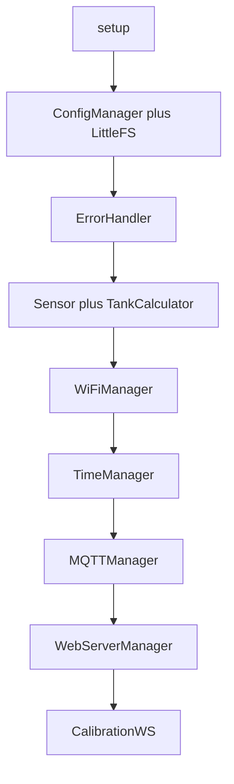

# FluidLevelMonitor — System Architecture

## Overview

ESP8266 (NodeMCU) firmware: cooperative **single-threaded** `loop()`. Concurrency is **logical** only—WiFi stack, MQTT, HTTP, and WebSocket callbacks interleave with `yield()` / `handleClient()`. There are no OS threads.

## Boot and initialization sequence

1. `Serial` @ 115200, `Version::printInfo()`
2. **ConfigManager::begin** — LittleFS mount (format on failure), `loadConfig()`, `validateConfig()`
3. **ErrorHandler::begin** — `errors.json` presence (lazy lookups)
4. **Sensor** — `SensorFactory::createSensor`, `begin()`, filter pipeline
5. **TankCalculator** — `begin()`
6. **WiFiManager::begin** — STA or AP fallback
7. **TimeManager::begin** — NTP when STA connected
8. **MQTTManager::begin**
9. **WebServerManager::begin** — HTTP + REST + static files
10. **CalibrationWebSocket::begin**
11. OTA callbacks registered on **WiFiManager** (Arduino OTA path)
12. First `readSensor()`

## Main loop order

Typical order in `processLoop()`:

1. `WiFiManager::loop()` — reconnect, Arduino OTA handling, AP DNS
2. If **Arduino OTA active** — early return (sensor/MQTT/web minimized)
3. `MQTTManager::loop()`
4. If WiFi STA: `webServer->loop()`, `calibrationWS->loop()`
5. `readSensor()` on interval from config
6. `publishMQTT()` on interval
7. Periodic status print (debug)

## Module responsibilities

| Module | Role |
|--------|------|
| **ConfigManager** | JSON config on LittleFS; atomic save via temp file; write serialization during POST |
| **ErrorHandler** | Codes, history, rate-limited log; `errors.json` lookups (cached) |
| **Log** | `[FLM][LEVEL][Module]` Serial output; secrets never logged |
| **WiFiManager** | STA/AP, captive DNS, scan, Arduino OTA hooks |
| **MQTTManager** | PubSubClient, publish level JSON, reconnect backoff |
| **WebServerManager** | Static UI, REST API, Web firmware upload |
| **CalibrationWS** | WebSocket live distance for calibration |
| **TankCalculator** | Volume, state from `ISensor` distance |

## OTA paths

| Path | Flow |
|------|------|
| **Arduino OTA** | WiFiManager; `prepare` stops MQTT/WS and HTTP server; on error `restore` restarts services |
| **Web POST /api/update** | Multipart upload; `prepare` frees MQTT/WS only; HTTP stays up; abort calls `restore`; success reboots |

## Memory and failure domains

- **Heap**: JSON `String` builds on API and MQTT; prefer bounded payloads where possible.
- **LittleFS full**: `saveConfig` checks free space; returns `ERR_FS_FULL` / HTTP 507-style messaging where implemented.
- **Config corruption**: Backup before save; on JSON parse failure after load, restore from `config.bak` when possible.
- **Threat model**: No HTTP auth on LAN—device must be on a trusted network.

## Config write semantics

Only one REST config write at a time (`tryLockForConfigWrite`). In-flight reads may see the previous config for one loop iteration; full struct swap is not used (documented tradeoff).

## Logging

Serial-only. Prefix `[FLM][LEVEL][Module]`. Do not log WiFi/MQTT passwords or full credential blobs. See [CODE_STYLE.md](CODE_STYLE.md) and [DEVELOPER_GUIDE.md](DEVELOPER_GUIDE.md).

## Related docs

- [API_REFERENCE.md](API_REFERENCE.md) — REST/MQTT/WebSocket
- [USER_GUIDE.md](USER_GUIDE.md)
- [TROUBLESHOOTING.md](TROUBLESHOOTING.md)
- [MANUAL_TEST_MATRIX.md](MANUAL_TEST_MATRIX.md)
