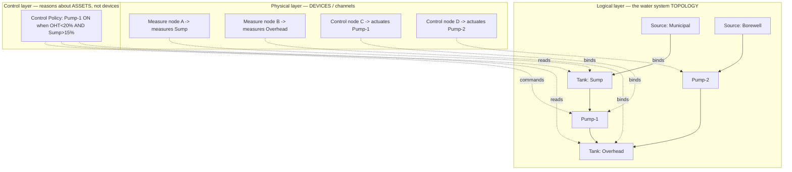
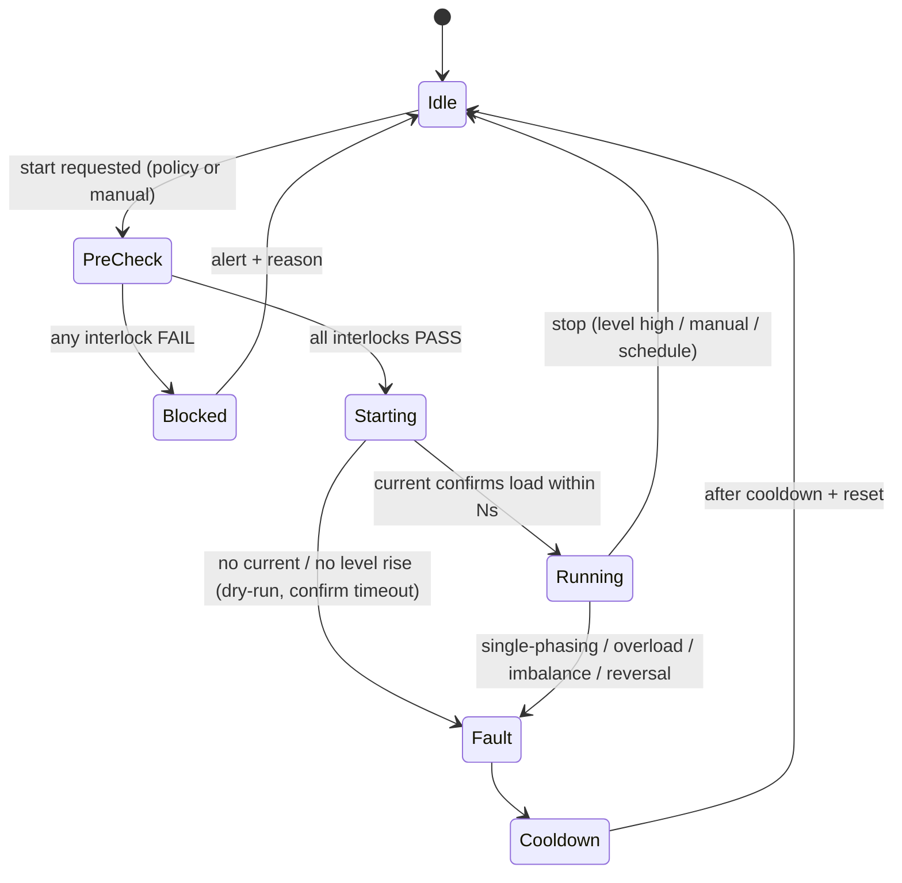
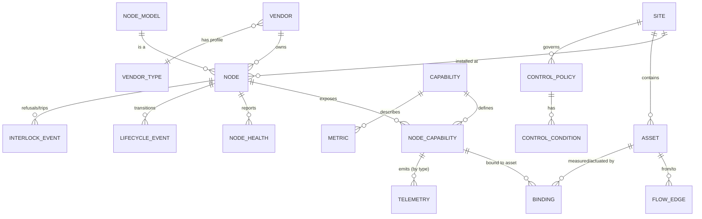

# FLM Platform Redesign — Generic IoT Node & Water-System Model

> Brainstorm session record. Captured: 2026-07-17.
> Status: **design brainstorm** — not yet implemented. Supersedes the water-only
> assumptions baked into `V1`–`V6`. Feeds into (does not replace) `CONSOLIDATED_PLAN.md`.

---

## 0. Why this exists

The platform today is hardcoded to **one purpose: water level logging**.

- `devices.topic_prefix DEFAULT 'water'`
- `level_readings` has water-specific typed columns (`percent_filled`, `water_height_mm`, …)
- `DeviceService.sendCommand()` assumes a single `/water/command` channel
- `vendors` is only a tenant — it has no *type*

The goal of this redesign: turn FLM into a **generic IoT node platform** that supports
measuring nodes, motor-control nodes (single- and three-phase), and flow/valve-control
nodes; multiple communication transports (WiFi, 4G, LoRa); a full device lifecycle; and
multiple vendor types (household, apartment, water utility / Mission Bhagiratha, farmer
irrigation) — while staying **modular, extensible, and reusable**.

The three ideas that make everything else fall out:

1. **A Node is a bag of Capabilities** (not "a water sensor").
2. **A logical water-system topology sits between devices and control logic** — devices
   measure/actuate *assets*; policies reason about *assets*. Devices become swappable.
3. **Control is two-tier**: hard electrical safety interlocks live in device firmware
   (milliseconds, local); soft cross-asset intent lives in the cloud/gateway (seconds,
   remote).

---

## 1. The core reframe

| Today (implicit) | Redesign (explicit) |
|---|---|
| A device *is* a water-level sensor | A **Node** *has* one or more **Capabilities** |
| One telemetry shape (`level_readings`) | Telemetry described by a **Metric Registry** per capability |
| One command channel (`/water/command`) | Each **Channel** (capability instance) has its own commands |
| Vendor = just a tenant | Vendor has a **type/profile** enabling capabilities & features |
| Device = measure only | Node has a **role** (measure / control / both) + **lifecycle state** |
| WiFi/MQTT only | **Transport** is abstracted: WiFi-MQTT, 4G-MQTT, LoRa-via-gateway |
| Device controls its own motor | **Logical assets** link measure ↔ control; policy reasons about assets |

---

## 2. Domain concepts

- **Node** (was `device`): the physical unit. Static identity: chip/board, comms, firmware.
- **NodeModel / DeviceType (catalog)**: reusable static hardware profile — `board`, `mcu`,
  `comms`, ADC scaling, pin map, **capability profile**, **protection profile**. Many nodes
  share one model. Adding a device *type* = a catalog row, not an enum/code change.
- **Capability**: a typed, namespaced contract — `measure.water_level`,
  `measure.temperature`, `measure.humidity`, `measure.soil_moisture`,
  `measure.motor_electrical`, `measure.flow`, `control.motor`, `control.valve`,
  `system.health`.
- **Channel** (capability instance): one node may have *N* valves → *N* `control.valve`
  channels, each individually addressable (`chan_index`, name). This is what makes
  multi-valve irrigation work.
- **Metric Registry**: data-driven description of each metric a capability emits — `key`,
  `unit`, `data_type`, `min/max`, `display`. Drives **validation and the UI** (a new gauge
  needs no code).
- **Attributes**:
  - **Static** (fixed at install): location, install date, model, firmware, comms, tank
    geometry, soil type. Typed columns where common + `JSONB` for the long tail.
  - **Dynamic** (telemetry): level, temp, humidity, soil moisture, battery, CPU%, mem,
    RSSI, IP, per-phase voltage/current. Time-series.
- **Lifecycle state machine**:
  `PROVISIONED → INSTALLED → ACTIVE ⇄ MAINTENANCE ⇄ FAULT → DECOMMISSIONED`. Ingest
  behavior depends on state (maintenance = suppress alerts / block real actuation;
  decommissioned = reject data). Transitions audited (reuse `platform_audit_log`).
- **Site / Installation**: groups nodes at a physical place **and defines relationships
  between them** — the piece that makes sump+overhead, Mission Bhagiratha (>5 km), and
  irrigation work.
- **Vendor + VendorType/Profile**: `HOUSEHOLD`, `APARTMENT`, `WATER_UTILITY` (Bhagiratha),
  `IRRIGATION`. The profile is a **solution template**: enabled capabilities, default
  dashboards, automation templates, roles.
- **Automation / Control Policy**: cross-node logic referencing **assets**, not devices.

---

## 3. Static vs variable attributes — the storage decision

The central storage tension, three options:

1. **Typed columns everywhere** (today's `V6`): fastest queries, type-safe, but *every new
   metric = a migration*. Rigid.
2. **Pure EAV / JSONB** (`device_id, metric_key, ts, value`): infinitely flexible, but at
   18k nodes × 5 years it explodes row counts and slows analytics.
3. **Hybrid (recommended):**
   - **Hot, high-volume, known telemetry → typed per-capability partitioned tables**
     (`telemetry_water`, `telemetry_soil`, `telemetry_env`, `telemetry_motor_electrical`,
     `telemetry_health`). Keeps V6's partitioning + BRIN performance.
   - **Static + rare attributes → `JSONB`** on `node` / `node_capability`, validated
     against the Metric Registry.
   - **Metric Registry** is the source of truth so storage and UI stay data-driven.

`level_readings` simply becomes `telemetry_water` — one capability among several.
`device_latest` generalizes to `channel_latest` (latest snapshot per channel) plus a
`node_health_latest`.

---

## 4. The three-layer model (the "10 steps ahead" insight)

Measurement points and control points are **almost never 1:1**, even in a house. A pump
decision depends on *two* tank levels (overhead + sump); two pumps may fill *one* tank; one
tank may be fed by *multiple sources*. If devices reference each other directly, every new
permutation is a special case.

Fix: **put a logical layer between physical devices and control logic.**

- **Assets** (Source, Tank, Pump, Valve) = the logical water system.
- **Flow edges** = directed graph of how water moves (`source → pump → tank`).
- **Bindings** = a device *channel* attaches to an asset with a role (`MEASURES` /
  `ACTUATES`).
- **Control policies** reference **assets**, so they don't care whether the sump sensor and
  the pump relay are the same board, adjacent, or 5 km apart on LoRa.

Device replacement (dead sensor swap) becomes a **re-binding**, not a redesign.

---

## 5. Scenarios — all expressed as topology, no special cases

Household/apartment are **not** co-located: sump stores municipal water, pumped to overhead
based on **both** sump and overhead levels. Borewell setups fill the overhead directly (with
or without storage). Storage tanks can be multiple. Two motors may fill one overhead.

| Scenario | Assets | Flow edges | Bindings | Policy |
|---|---|---|---|---|
| **Sump → OHT** (municipal) | Municipal src, Sump, Pump-1, OHT | src→Sump, Sump→Pump1→OHT | 2 measure (Sump, OHT), 1 control (Pump1) | Pump1 ON: `OHT<low AND Sump>min` |
| **Borewell direct** | Borewell, Pump, OHT | BW→Pump→OHT | 1 measure (OHT), 1 control (Pump) | Pump ON: `OHT<low`; dry-run guard |
| **Borewell + optional storage** | BW, (Storage?), Pump, OHT | BW→Pump→OHT (+→Storage) | measure OHT (+Storage) | same, storage optional |
| **Multiple storage tanks** | Sump-1, Sump-2, … | each →Pump→OHT | N measure | policy picks available source |
| **Two motors → one OHT** | Pump-1, Pump-2, OHT | both →OHT | 2 control | **coordination**: lead/lag / alternate / failover |
| **Apartment multi-floor** | OHT, floor tanks | OHT→…→floors | many measure | per-branch policies |
| **Irrigation** | Source, Pump, main line, Valve×N, soil zones | src→Pump→main→valves→zones | measure(tank, soil), control(pump, valves) | schedule + rotation across zones |

Every row is the **same** schema: assets + edges + bindings + policy. The differences are
just data.

---

## 6. Device catalog & type taxonomy

Device types are **catalog entries**, each advertising a capability + protection profile:

| Model | Role | Capabilities | Protections | Comms |
|---|---|---|---|---|
| Level sensor (A02YYUW) | measure | `measure.water_level`, `measure.env`, `system.health` | — | WiFi/LoRa |
| Single-φ motor controller | control | `control.motor`, `measure.motor_electrical` | over/under-voltage, over-current, dry-run | WiFi/4G |
| **Three-φ motor controller** | control | `control.motor`, `measure.motor_electrical` | **phase presence (R/Y/B), phase sequence/reversal, single-phasing, imbalance**, over/under-V, over-current, dry-run | 4G/LoRa |
| Valve / flow controller | control | `control.valve` (×N channels), `measure.flow` | valve-stuck detect | LoRa |
| Gateway | edge | routing, edge policy execution | — | LoRa↔4G |

On birth/announce, a device reports its model → backend derives capabilities, protections,
and valid bindings/policies. Adding a "three-phase controller v2" = one catalog row.

---

## 7. Electrical protection & interlocks (single- and three-phase)

Split the motor into two capabilities:
- `control.motor` — actuation (ON/OFF, mode).
- `measure.motor_electrical` — per-phase voltage/current, phase sequence, phase-present
  flags, power, run-state.

**Interlocks** are hard preconditions that must ALL be true to energize.

3-φ start interlocks: **all three phases present** ∧ **correct R-Y-B sequence (no reversal)**
∧ **voltage in range** ∧ **no cooldown active** ∧ **source has water** ∧ **tank not full** ∧
**no manual lockout**.
Single-φ: drops phase presence/sequence; keeps voltage/current/dry-run.

Fault reset policy per interlock:
- **Latching** (needs human fix): phase reversal (wiring), persistent single-phasing.
- **Auto-retry after cooldown**: brief under-voltage, transient overload.

Commissioning check: on install, a supervised "test start" verifies phase sequence once and
stores the expected sequence, so later reversal is detectable.

---

## 8. Two-tier control split (safety consequence)

A 3-φ motor started under phase reversal or single-phasing can be destroyed in seconds — you
cannot wait on a LoRa/4G round-trip. Therefore:

| Tier | Runs on | Responsibility | Latency need |
|---|---|---|---|
| **Hard safety interlocks** | **motor control device firmware** (local) | phase presence/sequence/reversal, single-phasing trip, overload, dry-run cutoff | milliseconds — must be local |
| **Soft intent / site policy** | server or gateway | fill-from-sump-when-low, multi-pump lead/lag, schedules, cross-asset logic | seconds — can be remote |

The cloud policy says *"I want Pump-1 ON"*; the firmware is the **final authority** and will
refuse/trip on any electrical interlock failure, reporting the reason. The site policy treats
"motor refused: phase missing" as a fault → alert, try alternate pump (failover), don't retry
blindly.

Existing firmware primitives to promote into this model: `pumpOnPercent`, `pumpOffPercent`,
`maxRunMinutes`, `confirmTimeoutMs`, `activeLow` (from `data/config.json` relay block).

---

## 9. Control policy engine — failure modes to design in now

- **Multi-input conditions**: ON needs *overhead low* AND *source has water* (dry-run
  protection). Single-device control cannot express this.
- **Hysteresis**: separate on/off thresholds (already present) to avoid pump chatter.
- **Dry-run / source-empty**: never run a pump when its source asset is below minimum.
- **Overflow protection**: hard stop at overhead-high, independent of the fill policy.
- **Max runtime + cooldown**: safety ceiling.
- **Multi-pump coordination**: lead/lag (balance wear), alternate (rotate), failover.
- **Command confirmation**: pump ON → expect level rise / current within N; else fault.
- **Stale-input safety**: if the measure device feeding a policy goes offline, fail **safe**
  (hold / time fallback / alert) — never run blind. Critical across independent LoRa/4G
  uplinks.
- **Manual override & lockout**: force ON/OFF, block automation (ties to MAINTENANCE state).
- **Where it runs**: co-located (rare) → device self-control; distributed → server or
  gateway. Same policy definition, execution site chosen per connectivity.

---

## 10. Vendor registration = guided topology builder (the crux)

Registration is **not** "add a device." It's **model the water system, then attach
hardware.** A wizard driven by `vendor_type`:

1. **Site** — create the installation (home / building / village / farm). A vendor may have
   many.
2. **Declare assets** — tanks (sump/overhead/storage + capacity + geometry), sources
   (municipal/borewell), pumps, valves. (Existing tank config lives here.)
3. **Draw flows** — connect source→sump→pump→overhead. Builds the graph.
4. **Add devices from the catalog** — pick model → device announces/binds → capabilities &
   protections come from the catalog automatically.
5. **Bind channels to assets** — level sensor→Overhead, 3-φ controller→Pump-1.
6. **Configure policies (intent)** + review the device's built-in interlocks (safety).
7. **Users & roles** — who can view / override / configure.

Because assets exist independently of devices, a vendor can pre-model before hardware
arrives, swap a failed sensor without touching policies, and add a second motor later
(new control node → new Pump asset → coordination = lead/lag) with no schema change.

---

## 11. Multi-tenant logins & per-vendor-type dashboards

The multi-tenant foundation **already exists**: `DeviceService.register()` enforces
`tenantGuard.requireVendorScope(vendorId)`, and `TenantGuard` / `AuthPrincipal` scope every
query by `vendorId` (super-admin sees all). "Each vendor sees only his own stuff" is already
the model — we extend it.

What's new: `vendor_type` selects a **dashboard profile**.

| Vendor type | Login lands on | Primary view |
|---|---|---|
| Household | "My House" | Sump + Overhead levels, pump status, phase health |
| Apartment | "My Building" | Multi-tank fleet, per-block pumps, consumption |
| Bhagiratha (utility) | "My Network" | Map of village OHTs, remote pumps, phase/comms alarms |
| Farmer (irrigation) | "My Field" | Soil zones, valve rotation, source tank, pump electrical |

Same backend, same auth, same asset model — the profile changes enabled capabilities +
default UI. One codebase, four experiences.

---

## 12. Transport abstraction (WiFi / 4G / LoRa)

Ingest normalizes everything to an internal **DeviceEvent** before it touches the domain:

- WiFi/4G → MQTT (current bridge; generalize `+/water/#` to capability-based topics).
- LoRa → LoRaWAN network server / gateway → HTTP or MQTT into the same ingest.
- Domain and rules never see the transport.

Suggested topic scheme: `{deviceTag}/{capability}/{stream}` —
e.g. `tank1/water_level/telemetry`, `pump1/motor/command`, `node1/system/health`,
`pump1/motor_electrical/telemetry`.

---

## 13. Capability-oriented code modularity

Current modules (`flm-domain`, `flm-api`, `flm-mqtt-bridge`, `flm-platform-admin`) are a good
base. Extend with a **plugin/handler pattern**:

- `CapabilityHandler` interface: `parse(event)`, `validate(registry)`, `persist(telemetry)`,
  `commands()`, `metrics()`.
- One implementation per capability: `WaterLevelHandler`, `SoilMoistureHandler`,
  `MotorControlHandler`, `MotorElectricalHandler`, `ValveControlHandler`, `HealthHandler`.
- Ingest pipeline: `transport → normalize → route by capability → handler.persist +
  ruleEngine.evaluate`.
- Adding a capability = new handler + registry rows. **Zero changes to core tables/ingest.**

---

## 14. Device self-description (also fixes today's "not registered" gap)

On connect, a node publishes a **birth/announce** message: model, firmware, comms, capability
list. The backend auto-provisions `node_capabilities` (pending approval for new tags). This:

- Auto-populates channels (e.g. "this node has 4 valves").
- Fixes the observed `deviceTag ... is not registered` **drop** — unknown tags land in a
  "pending devices" queue instead of vanishing.

---

## 15. Proposed schema evolution (additive, builds on V1–V6)

Migration steps (new Flyway versions, all additive / backward compatible):

- **V7** — `vendors.vendor_type`; `node_model` (catalog) table; `nodes.lifecycle_state`,
  `comm_type`, `model_id`, `attributes JSONB`; `sites` table + `nodes.site_id`.
- **V8** — `capabilities`, `metrics` (registry), `node_capabilities` (channels).
- **V9** — per-capability telemetry tables (rename/extend `level_readings` →
  `telemetry_water`; add `telemetry_soil`, `telemetry_env`, `telemetry_motor_electrical`,
  `telemetry_health`); `channel_latest`; `motor_electrical_latest`.
- **V10** — logical layer: `asset`, `flow_edge`, `binding`, `control_policy`,
  `control_condition`, `coordination_group`, `node_relationships`, `lifecycle_events`,
  `interlock_event`.

Backward compat: the existing water flow keeps working — it is just
`capability = measure.water_level`.

Table sketches:
- `device_model(id, name, role, capability_profile_json, protection_profile_json, comms)`
- `asset(id, site_id, kind, subtype, capacity_l, geometry_json, attributes_json)`
- `flow_edge(id, site_id, from_asset_id, to_asset_id, via_asset_id)`
- `binding(id, channel_id, asset_id, role, valid_from, valid_to)`
- `control_policy(id, site_id, actuator_asset_id, mode, enabled, coordination_group_id)`
- `control_condition(policy_id, expr)` — e.g. `OHT.percent < 20 AND SUMP.percent > 15`
- `coordination_group(id, strategy)` — LEAD_LAG | ALTERNATE | FAILOVER
- `interlock_event(device_id, ts, interlock_key, state, reason)`

---

## 16. Fault / interlock code taxonomy (shared firmware + backend + UI)

A single shared vocabulary so firmware, backend, and UI agree:

`phase_missing`, `phase_reversed`, `single_phasing`, `phase_imbalance`, `over_voltage`,
`under_voltage`, `over_current`, `dry_run`, `confirm_timeout`, `overflow`, `max_runtime`,
`cooldown_active`, `manual_lockout`, `source_empty`, `sensor_stale`, `comms_lost`.

Each has: severity, latching vs auto-reset, and which tier detects it (edge vs cloud).

---

## 17. Think-ahead edge cases to model from day one

1. **Device ≠ asset lifecycle** — sensor dies & is replaced; asset history + policies survive
   (bindings are time-bounded/versioned).
2. **One device, multiple assets** — a 2-channel board measuring sump *and* overhead.
3. **Shared source across sites** — Bhagiratha: one reservoir feeds many village OHTs
   (asset/site hierarchy).
4. **Same OHT, two sources with priority** — municipal preferred, borewell fallback.
5. **Scheduled vs level-triggered** — irrigation rotation vs tank fill (`policy.mode`).
6. **Metered/quota** — municipal limits, pumping energy cost (asset attributes + reports).
7. **Partial connectivity** — edge autonomy so a village pump keeps working when backhaul
   drops.
8. **Commissioning vs live** — an `INSTALLED`-but-not-`ACTIVE` node must not drive real
   pumps.
9. **Audit & safety trail** — who/what turned the pump on and which condition fired
   (`platform_audit_log` + `interlock_event`).
10. **Simulation / dry-run mode** — validate a new topology + policy against historical data
    before actuating real hardware.
11. **Phase telemetry as predictive data** — log per-phase V/I to *predict* pump failure
    (imbalance trend), not just react.

---

## 18. Architecture decisions — RESOLVED (2026-07-17)

1. **Telemetry storage → HYBRID.** Hot, known metrics in typed per-capability partitioned
   tables; rare/static in JSONB; a metric registry is the source of truth.
2. **Rule execution → BOTH, per-policy + vendor-selectable.** Each control policy carries an
   `execution = CLOUD | EDGE` field. Default per vendor type, overridable by the vendor/site.
   (Not a global switch — a setting on each policy.)
3. **LoRa → PARKED.** Revisit when a LoRa node is actually built; do not design the transport
   for it yet. WiFi/4G-over-MQTT only for now.
4. **Logical asset/topology layer → YES, commit.** Assets + flow edges + bindings decouple
   physical devices from the water system. Built in Phase 3 (L-epic).
5. **Two-tier control split → YES, confirmed.** Hard electrical interlocks in device firmware
   (or external panel); soft cross-asset intent in cloud/edge.
6. **Protection profile → DATA.** Catalog `protection_profile` (JSONB) declares which
   protections a model enforces; adding a controller type = a catalog row, not code. (The
   low-level phase/current *measurement* is still firmware; the data layer selects which
   checks are active.)
7. **First increment → BIG START.** Build Foundations + Capabilities + Topology as one larger
   milestone rather than shipping `V7` alone and growing incrementally. More upfront before
   the first demo, but less rework.

---

## 19. Suggested phased roadmap

- **Phase 0 (safety net, this week):** device-side heap guard + RAM budget assert; OTA
  pre-flight; `pg_dump` backup before DB wipes; unregistered-device "pending" queue.
- **Phase 1 (foundations):** `vendor_type` + dashboard profiles; `node_model` catalog;
  `lifecycle_state`; `node_health` telemetry; birth/announce self-registration.
- **Phase 2 (capabilities):** capability + metric registry; `CapabilityHandler` plugin
  pipeline; migrate water level to `measure.water_level`; add `measure.env`,
  `measure.soil_moisture`.
- **Phase 3 (logical layer):** assets + flow edges + bindings; guided registration wizard.
- **Phase 4 (control):** control policy engine (multi-input, hysteresis, coordination);
  two-tier split; electrical interlocks + fault taxonomy for single/three-phase.
- **Phase 5 (transport + scale):** LoRa/4G transport abstraction; edge gateway autonomy;
  simulation/dry-run; predictive phase analytics.

---

## 20. Reconciliation with `CONSOLIDATED_PLAN.md` (SudarshanChakra)

There are effectively **two backend tracks** in the repo, and this redesign must be read
against that fact:

| | **Track A — SudarshanChakra (SC)** | **Track B — this repo's `server/`** |
|---|---|---|
| Source | `CONSOLIDATED_PLAN.md` (2026-03) | `server/` (active; today's work) |
| Broker | RabbitMQ 3 (MQTT plugin) | Mosquitto 2 |
| Backend | 5 SC Spring Boot microservices | `flm-api` monolith modules (`flm-domain`, `flm-api`, `flm-mqtt-bridge`, `flm-platform-admin`) |
| DB | SC PostgreSQL (`water_tanks`, `water_motor_controllers`, …) | FLM PostgreSQL, Flyway `V1`–`V6` |
| UI | SC React + SC Android app | `server/frontend` React |
| Multi-tenant | SC's model | `vendors` + RBAC + `TenantGuard` (already built) |

**This redesign targets Track B** — the self-contained `server/` platform, which is what
today's session (fresh Postgres, `flm-api`, Flyway) actually runs. `CONSOLIDATED_PLAN.md`
described plugging water into the **existing SC platform** as a device class. Those are two
different deployment strategies.

> **DECISION (2026-07-17): Track B confirmed.** SudarshanChakra is **not** in place and is
> deferred to much later. All work targets the standalone `server/` platform. Accordingly,
> `CONSOLIDATED_PLAN.md` is now a *future deployment/integration option*, **not** the
> authoritative backend spec. Any SC references below are forward-looking only.

### Concept mapping (SC water-specific → generic model)

| `CONSOLIDATED_PLAN.md` (water-specific) | This redesign (generic) |
|---|---|
| `water_tanks` | `asset(kind=TANK, subtype=SUMP/OVERHEAD/STORAGE)` |
| `water_motor_controllers` (control_type relay/sms) | `asset(kind=PUMP)` + `node(role=control)` + `device_model(control_type)` |
| `water_tank_motor_map` (motor serves 1-N tanks) | `flow_edge` + `binding` + `coordination_group` |
| RabbitMQ `water.level` / `motor.status` / `motor.alert` | capability streams `{tag}/{capability}/{stream}` over MQTT |
| `pump_on` / `pump_off` / `pump_auto` commands | `control.motor` commands (preserved verbatim) |
| cloud auto-command logic (§6.4) | **soft-intent tier** (control policy engine) |
| "never fill 2 linked tanks at once (overcurrent)" | `coordination_group(strategy=…)` |

### Real deployments become seed data + validation

`CONSOLIDATED_PLAN.md §2` already documents live topologies that this model must express:

- **Sangareddy Farm** — 3 tanks, one 5 HP motor via **Taro Smart Panel over SMS**, Edge Node
  + OpenVPN → VPS. Maps to: `site=Farm`; 3 × `asset(TANK)`; 1 × `asset(PUMP)` bound to a
  `node(model=motor_sms)`; `flow_edge` pump→each tank; `coordination_group` to prevent
  simultaneous fill.
- **Home** — sump + overhead, relay motor. Maps to: `site=Home`; 2 × `asset(TANK)`;
  1 × `asset(PUMP)` bound to `node(model=motor_relay)`; policy `OHT<low AND Sump>min`.

### Firmware roles ↔ device catalog

The existing compile-time roles are the first catalog rows:

| `platformio.ini` flag | `device_model` catalog entry | Where electrical safety lives |
|---|---|---|
| `FLM_ROLE_SENSOR` | `sensor` (measure) | n/a |
| `FLM_ROLE_MOTOR_RELAY` | `motor_relay` (control) | our firmware interlocks |
| `FLM_ROLE_MOTOR_SMS` | `motor_sms` (control) | **the Taro Smart Panel** (external) — our node only sends SMS |
| *(future)* | `motor_3ph` (control) | our firmware: phase presence/sequence/single-phasing |

**Two-tier nuance:** for `control_type=sms`, the "hard safety" tier is the **Taro panel**, not
our device. Our own single-/three-phase controllers own that tier only when *we* build the
panel. The model must record *where* interlocks are enforced per node.

### Android / frontend fork

`CONSOLIDATED_PLAN.md §7` says water UI belongs **inside the SudarshanChakra Android app**,
while `server/frontend` is a separate React UI. Same Track A/B decision applies to the client
layer and should be resolved together with the backend one.
